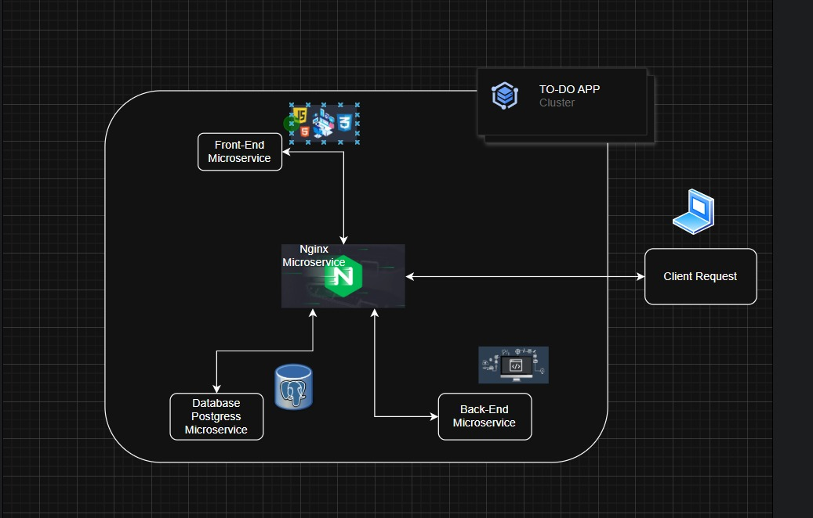

# 📝 Todo Application


## Team Members

- **Abdalrhman Magdy**
- **Mohamed Ezzat**
- **Safiya Mahmoud**
- **Mahmoud Hanafy**
- **Ahmed Tarek**

---

## Project Overview

A production-ready Todo application built to demonstrate enterprise DevOps practices and cloud-native architecture. This full-stack application showcases modern software development methodologies, containerization, orchestration, and comprehensive monitoring capabilities.

### Key Features

- **User Management**: Secure authentication with JWT tokens and bcrypt password hashing
- **Task Management**: Full CRUD operations with priorities, due dates, and image attachments
- **Google Calendar Integration**: Seamless task synchronization with Google Calendar
- **Real-time Monitoring**: Prometheus metrics collection and Grafana dashboards
- **Cloud-Native**: Kubernetes-ready with health checks, auto-scaling, and persistent storage
- **CI/CD Pipeline**: Automated testing, building, and deployment workflows

---

## Technology Stack

### Backend

- **FastAPI** — High-performance Python web framework
- **PostgreSQL** — Relational database with ACID compliance
- **JWT** — Secure token-based authentication
- **Bcrypt** — Password hashing and security

### Frontend

- **React** — Modern UI library with component-based architecture
- **Vite** — Fast build tool and development server
- **Responsive Design** — Mobile-first approach

### Infrastructure & DevOps

- **Kubernetes** — Container orchestration and deployment
- **Docker** — Containerization with multi-stage builds
- **Nginx** — Reverse proxy and load balancing
- **Prometheus & Grafana** — Metrics collection and visualization
- **Helm** — Kubernetes package management

### Integration & APIs

- **Google Calendar API** — Task synchronization
- **OAuth 2.0** — Secure third-party authentication

---

## System Design & Architecture

### Use Case Diagram

The following use case diagram illustrates the main functionalities and interactions within the Todo application:


**Key Use Cases:**

- **User Authentication**: Users can sign up, log in, and manage their account credentials
- **Task Management**: Core functionality including creating, reading, updating, and deleting tasks
- **Task Organization**: Users can set priorities, due dates, and categorize tasks
- **Task Enhancement**: Upload images and add detailed descriptions to tasks
- **Calendar Integration**: Synchronize tasks with Google Calendar for cross-platform accessibility
- **Profile Management**: Update user information and change passwords
- **Task Filtering**: View tasks by status (All Tasks, Vital Tasks, Completed Tasks)

### Entity-Relationship Diagram (ERD)

The database schema is designed to support multi-user task management with comprehensive task attributes:


**Database Schema Overview:**

**Users Table:**

- Primary entity storing user account information
- Fields: `id` (PK), `username`, `email`, `password_hash`, `created_at`, `updated_at`
- Implements secure authentication with bcrypt password hashing
- Supports JWT-based session management

**Todos Table:**

- Central table for task storage and management
- Fields: `id` (PK), `user_id` (FK), `title`, `description`, `status`, `priority`, `due_date`, `created_at`, `updated_at`, `image_filename`
- Status values: `pending`, `in_progress`, `completed`
- Priority levels: `low`, `medium`, `high`
- Supports optional image attachments stored on filesystem

**Relationships:**

- **One-to-Many**: Each User can have multiple Todos (1:N relationship)
- **Foreign Key Constraint**: `todos.user_id` references `users.id` with cascade delete to maintain referential integrity
- **Indexing Strategy**: Optimized queries on `user_id`, `status`, and `due_date` for efficient task retrieval

This normalized database design ensures data integrity, prevents redundancy, and supports efficient querying for user-specific task management operations.

### Sequence Diagram

The sequence diagram below demonstrates the complete request-response flow for critical user interactions within the application:


**Key Interaction Flows:**

**1. User Authentication Flow:**

- User submits login credentials through the frontend interface
- Frontend sends authentication request to the backend API
- Backend validates credentials against the PostgreSQL database
- Upon successful validation, JWT token is generated and returned
- Frontend stores the token and redirects user to the dashboard

**2. Task Creation Flow:**

- Authenticated user fills out task creation form (title, description, priority, due date)
- Optional image upload is processed and validated on the client side
- Frontend sends POST request with task data and JWT token to backend
- Backend validates the token and user authorization
- Task data is persisted in the PostgreSQL database
- Image file (if provided) is stored in the filesystem with reference saved in database
- Success response is returned with the newly created task object
- Frontend updates the UI to display the new task

**3. Task Retrieval Flow:**

- User navigates to tasks page (Dashboard, My Tasks, or Vital Tasks)
- Frontend requests task list with filter parameters and JWT token
- Backend authenticates the request and queries database for user-specific tasks
- Tasks are filtered by status, priority, or due date as requested
- Database returns matching records
- Backend serializes task data and sends response
- Frontend renders tasks in the appropriate UI components

**4. Google Calendar Sync Flow:**

- User initiates calendar sync from the frontend
- Frontend redirects to Google OAuth authorization endpoint
- User grants calendar permissions
- Google redirects back with authorization code
- Backend exchanges code for access token and refresh token
- Tokens are securely stored in the database
- Backend fetches user's tasks and creates calendar events via Google Calendar API
- Sync status is returned to frontend with confirmation

This sequence-based architecture ensures secure, stateless communication between components while maintaining data consistency and user session integrity through JWT-based authentication.

---

## UI/UX Design

The application features a modern, intuitive interface designed with user experience as the top priority:

- **Responsive Layout**: Optimized for desktop, tablet, and mobile devices
- **Sidebar Navigation**: Quick access to Dashboard, Vital Tasks, My Tasks, and Profile
- **Interactive Modals**: Streamlined task creation, editing, and deletion workflows
- **Visual Feedback**: Real-time notifications for user actions and system responses
- **Consistent Design System**: Professional color palette and typography
- **Accessibility**: WCAG-compliant design patterns

[View Figma Design](https://www.figma.com/design/UMVJ76GUV2N0TzZwLfEHw1/Task-Manager-webDesign--Community-?m=auto&t=LnZhDKu5Waao2cSF-6)

---

## Kubernetes Deployment Architecture

The application follows a microservices architecture deployed on Kubernetes, with the following components and data flow:

### Architecture Diagram



The diagram above illustrates the complete Kubernetes architecture and request flow through the system. Here's how a user request travels through the infrastructure:

**Request Flow Path:**

1. **External User Request**

   - User accesses the application through their browser via the Nginx service endpoint
   - Request enters the Kubernetes cluster through the exposed NodePort/LoadBalancer

2. **Nginx Ingress Layer** (Entry Point)

   - Nginx pod receives all incoming HTTP/HTTPS traffic
   - Acts as reverse proxy and request router
   - Routes based on URL path:
     - API requests (`/auth/*`, `/todos/*`, `/uploads/*`) → Backend Service
     - Static content and SPA routes → Frontend Service
   - Provides load balancing across backend/frontend pods
   - Handles SSL/TLS termination (if configured)

3. **Frontend Service** (React Application)

   - Serves the React single-page application (SPA)
   - Deployed as containerized Vite build
   - Handles client-side routing
   - Sends API requests back through Nginx to backend
   - Stateless deployment allowing horizontal scaling

4. **Backend Service** (FastAPI Application)

   - Processes business logic and API requests
   - Validates JWT tokens for authentication
   - Manages CRUD operations for tasks
   - Handles file uploads to persistent storage
   - Communicates with PostgreSQL for data operations
   - Integrates with Google Calendar API for task synchronization
   - Exposes Prometheus metrics endpoint for monitoring

5. **PostgreSQL Database**

   - Stores user accounts and task data
   - Deployed with StatefulSet for data persistence
   - Uses PersistentVolumeClaim (PVC) to ensure data survives pod restarts
   - Internal service accessible only within the cluster
   - Provides ACID-compliant data storage

6. **Persistent Storage Layer**
   - **Database PVC**: Stores PostgreSQL data files
   - **Uploads PVC**: Stores user-uploaded task images
   - Ensures data persistence across pod lifecycle events
   - Supports volume expansion if needed

**Response Flow:**

- Backend queries database and processes request
- Response travels back: Backend → Nginx → User
- Frontend updates UI based on API responses

**Key Kubernetes Features Utilized:**

- **Services**: Enable pod-to-pod communication via DNS names
- **Deployments**: Manage replica sets for frontend and backend
- **StatefulSets**: Ensure stable storage for PostgreSQL
- **PersistentVolumes**: Provide durable storage for database and uploads
- **ConfigMaps**: Store Nginx configuration
- **Secrets**: Securely store database credentials and API keys
- **Health Probes**: Readiness and liveness checks ensure high availability
- **Resource Limits**: CPU and memory constraints for optimal resource utilization

---

## Backend API Endpoints

Below are the main API endpoints exposed by the FastAPI backend:

- **Authentication**

  - `POST /auth/signup` — Register a new user
  - `POST /auth/login` — Authenticate and receive JWT token
  - `GET /auth/me` — Get current user info (requires JWT)
  - `POST /auth/change-password` — Change user password (requires JWT)

- **Todos**

  - `GET /todos` — List all todos for the authenticated user
  - `POST /todos` — Create a new todo
  - `GET /todos/{id}` — Get a specific todo by ID
  - `PUT /todos/{id}` — Update a todo by ID
  - `DELETE /todos/{id}` — Delete a todo by ID

- **Uploads**

  - `POST /todos` (with image) — Upload an image as part of todo creation
  - `GET /uploads/{filename}` — Retrieve uploaded image by filename

- **Google Calendar Integration**
  - `GET /google-calendar/auth` — Initiate Google OAuth flow
  - `GET /google-calendar/callback` — Handle Google OAuth callback
  - `POST /google-calendar/sync` — Sync all tasks to Google Calendar
  - `GET /google-calendar/status` — Check if Google Calendar is connected
  - `DELETE /google-calendar/disconnect` — Disconnect Google Calendar

---

## 🚀 Quick Start

### Prerequisites

- **Minikube** installed and running
- **kubectl** configured
- **Docker** installed
- **Git** installed
- **Helm** installed (for monitoring stack)

### Setup Instructions

1. **Clone the repository**

   ```bash
   git clone https://github.com/abdo308/Todo-web-app.git
   cd Todo-web-app
   ```

2. **Configure Google Calendar (Optional)**

   To enable Google Calendar sync:

   a. Create a Google Cloud Project at [console.cloud.google.com](https://console.cloud.google.com/)

   b. Enable Google Calendar API:

   - Go to "APIs & Services" → "Library"
   - Search for "Google Calendar API" and enable it

   c. Create OAuth 2.0 Credentials:

   - Go to "APIs & Services" → "Credentials"
   - Click "Create Credentials" → "OAuth client ID"
   - Choose "Web application"
   - Add authorized redirect URIs:
     - `http://localhost:3000/google-calendar/callback`
     - `http://localhost:5173/google-calendar/callback`
   - Copy your Client ID and Client Secret

   d. Configure the secret:

   ```bash
   cp k8s/backend/backend-secret.yaml.example k8s/backend/backend-secret.yaml
   ```

   Edit `k8s/backend/backend-secret.yaml` and replace:

   - `YOUR_GOOGLE_CLIENT_ID_HERE` with your actual Client ID
   - `YOUR_GOOGLE_CLIENT_SECRET_HERE` with your actual Client Secret

3. **Start the application**

   ```bash
   chmod +x start.sh
   ./start.sh
   ```

   The script will:

   - Deploy PostgreSQL database
   - Deploy backend (FastAPI) and frontend (React)
   - Deploy Nginx reverse proxy
   - Set up port forwarding to `localhost:3000`

4. **Access the application**

   Open your browser at: **http://localhost:3000**

5. **Using Google Calendar Sync**
   - Create an account and login
   - Click the calendar button (📅) in the top right corner
   - Authorize the app to access your Google Calendar
   - Your tasks will be synced with their respective dates/times
   - Tasks without dates are scheduled for the next day at 9 AM

---

## 📊 Monitoring Setup (Optional)

To enable Prometheus and Grafana monitoring:

1. **Install Helm** (if not already installed)

   ```bash
   # On Linux
   snap install helm --classic

   # Or download from https://helm.sh/docs/intro/install/
   ```

2. **Install Prometheus Stack**

   ```bash
   # Add Prometheus community charts
   helm repo add prometheus-community https://prometheus-community.github.io/helm-charts
   helm repo update

   # Install kube-prometheus-stack
   helm install monitoring prometheus-community/kube-prometheus-stack \
     --namespace monitoring --create-namespace
   ```

3. **Start Monitoring Port Forwards**

   ```bash
   # Grafana (port 3001)
   chmod +x grafana.sh
   ./grafana.sh

   # Prometheus (port 9092)
   chmod +x prometheus.sh
   ./prometheus.sh
   ```

4. **Access Monitoring Tools**

   **Grafana Dashboard:**

   - URL: http://localhost:3001
   - Get admin password:
     ```bash
     kubectl get secret -n monitoring monitoring-grafana \
       -o jsonpath="{.data.admin-password}" | base64 --decode ; echo
     ```
   - Login with username: `admin` and the password from above

   **Prometheus:**

   - URL: http://localhost:9092

5. **Import Dashboard**

   In Grafana:

   - Go to Dashboards → Import
   - Click "Upload JSON file"
   - Select `k8s/monitoring/todo-dashboard.json`
   - Choose the Prometheus data source
   - Click Import

   The dashboard includes:

   - HTTP Request Rate by endpoint
   - Request Duration (Latency) - 95th and 50th percentile
   - HTTP Status Codes distribution
   - Success Rate percentage
   - Total Request count

6. **Generate Test Traffic** (Optional)

   To see live metrics on the dashboard:

   ```bash
   # Run continuous load test
   python3 load_test.py

   # Press Ctrl+C to stop
   ```

   The load test will send requests continuously and you'll see real-time metrics in Grafana.

---

## 🧪 Testing the Application

### Manual Testing

1. Register a new account
2. Login with your credentials
3. Create, edit, and delete tasks
4. Upload task images
5. Test Google Calendar sync (if configured)
6. Test priority levels and due dates

### Load Testing

```bash
# Install dependencies if needed
pip3 install requests

# Run load test (sends 100 requests)
python3 load_test.py

# Or run continuous load test (until stopped)
# Edit load_test.py and set NUM_REQUESTS = None
python3 load_test.py
```

---

## 🛑 Stopping the Application

```bash
# Stop port forwarding
pkill -f "kubectl port-forward"

# Delete all Kubernetes resources
chmod +x delete.sh
./delete.sh

# Or manually
kubectl delete -f k8s/backend/
kubectl delete -f k8s/frontend/
kubectl delete -f k8s/postgres/
kubectl delete -f k8s/nginx/
```

To also remove monitoring stack:

```bash
helm uninstall monitoring -n monitoring
kubectl delete namespace monitoring
```

---

## 🐳 Docker Compose (Alternative)

For local development without Kubernetes:

```bash
# Configure environment
cp .env.example .env
# Edit .env with your Google credentials

# Start with Docker Compose
docker-compose up -d

# Access at http://localhost:3000
```

---

## Production Deployment

The application is currently deployed and accessible at:

### Deployment Architecture

- **Container Orchestration**: Kubernetes
- **Monitoring**: Prometheus + Grafana
- **Database**: PostgreSQL with persistent storage
- **Load Balancing**: Nginx reverse proxy

---

## Contributing

This project was developed as part of a DevOps engineering course to demonstrate enterprise-level practices in containerization, orchestration, and monitoring.

### Team Members

- **Abdalrhman Magdy** - Backend Architecture & DevOps
- **Mohamed Ezzat** - CI/CD Pipeline & Infrastructure
- **Safiya Mahmoud** - Infrastructure & Testing
- **Mahmoud Hanafy** - Kubernetes & Deployment
- **Ahmed Tarek** - Frontend & Integration

---

## License

This project is created for educational purposes.

---

## Additional Notes

### Google Calendar OAuth

The application automatically detects the correct OAuth redirect URI. When using Kubernetes with port forwarding, always access via `localhost:3000` for proper OAuth functionality. Google OAuth does not work with private IP addresses (like `192.168.x.x`).
